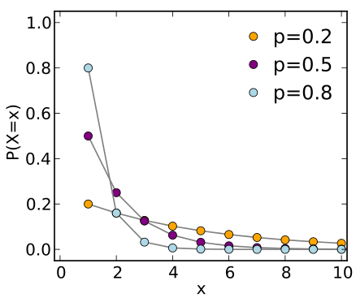

# Problem Description
<p style="text-align:left;font-size:130%;"><i>The design of optical multilayer systems </i></p>
Optical multilayer coatings are of remarkable importance in a number of application fields such as optical and scientific instrumentation manufacturing, spectroscopy, medicine, and astronomy. An optical multilayer coating consists of a set of plane parallel isotropic layers separating two homogeneous isotropic media (often these are air and a substrate). The permittivity and conductivity of the layers depend on one spatial coordinate perpendicular to the layer-media boundaries. A plane electromagnetic wave enters from the first medium (air) into the multilayer system and is partially reflected or transmitted at the borders between layers of different refractive indices.

The behavior of a multilayer system can be characterized by the ***spectral reflectance profile*** at the substrate, i.e., the dependence of reflectances on the wavelength. The spectral reflectance profile depends mainly on:

  * the number $n$ of layers.
  * their refractive indices $\vec{\eta} = (\eta_1,\ldots,\eta_n)$ of $n$ layers.
  * the thicknesses $\vec{d} = (d_{1},\ldots,d_n)$ of the $n$ layers.

Given these parameters, several methods are known to calculate the spectral reflectance profile of a multilayer system. Therefore, it is possible to find the parameters of an optimal multilayer system that approximates the desired spectral reflectance profile as well as possible. To measure the difference between the target reflectance $\tilde{R}(\lambda)$ ($\lambda$ denotes the wavelength) and the actual coating reflectance $R(\vec{d},\vec{\eta},\lambda)$ over some the spectral bands of interest, we usually aggregate the differences between $R$ and $\tilde{R}$ over a discrete number $m$ of (usually equidistant) wavelength values $\lambda_{i}$ ($1\leq i\leq m$):
\begin{equation}
\label{eq:mse_sum}
	f(\vec{d}, \vec{\eta}) = \sum_{i=1}^{m} \left [ R(\vec{d}, \vec{\eta}, \lambda_{i}) - \tilde{R}(\lambda_{i}) \right ]^{2} \Delta \lambda_i.
\end{equation}

Aguilera et al. (1988) proposed the design of an antireflection coating of germanium (*Ge*, $\eta=4.2$) and zinc sulfide (*Zn*, $\eta=2.2$) in the wave length region $7.7 - 12.3$ $\mu$m. Within this range, $m=47$ wavelength values are defined according to $\lambda_{0} = 7.7 \mu$m and $(i \in \{1,\ldots,m\})$:
\begin{equation}
\lambda_{i} = \lambda_{0} + \frac{i-1}{m-1} \cdot (12.3 - 7.7) \ \ \ [ \mu \text{m}] \ \ .
\end{equation}
The **objective function** is given by the ***reflection mean square*** (RMS) function: 
\begin{equation}
M(\vec{d}, \vec{\eta}) = \sqrt{\frac{1}{m} \sum_{i=1}^{m} R(\vec{d}, \vec{\eta}, \lambda_{i})^2} \rightarrow \min.
\end{equation}
It is a slight modification of $f(\vec{d}, \vec{\eta})$ with target reflectance $\tilde{R}(\lambda_{i})=0$ $(i \in \{1,\ldots,m \})$. In this exercise, the detailed expression of $R$ is hidden for brevity.

# The Exercise
Suppose we want to design a multilayer optical filter of $n=30$ layers. For each layer $i$ ($1\leq q\leq n$), we can control two parameters:

  * binary coating choice $c_i$:
    \begin{eqnarray}
    c_{i} & = & 
    \begin{cases}
    0 & \text{germanium (Ge, $\eta_i=4.2$)} \\
    1 & \text{zinc sulfide (Zn, $\eta_i=2.2$)}
    \end{cases}, \quad &
    \eta(c_i) & = & 
    \begin{cases}
    4.2 & c_i = 0 \\
    2.2 & c_i = 1
    \end{cases}.
    \end{eqnarray}
  * thickness $d_i$ with constraint $0\leq d_i \leq 10000$nm.

**Task**: To implement a ***Mixed Integer Evolution Strategy*** to find the optimal vector $\vec{d} \in \mathbb{R}^n$ of layer thicknesses ($0 \le d_{i} \le 10000$nm, $i=1,2,\ldots,n$) and the optimal vector $\vec{c} \in \{0, 1\}^n$ of coating material type. Formally, the minization problem is defined as:
\begin{equation*}
\begin{aligned}
& \underset{\vec{d}, \vec{c}}{\text{minimize}}
& & M(\vec{d}, \eta(\vec{c})) \\
& \text{subject to}
& & 0 \leq d_i \leq 10000, \; i = 1, \ldots, n, \\
& & & c_i \in \{0, 1\}, \; i = 1, \ldots, n.
\end{aligned}
\end{equation*}

# Mixed Integer Evolution Strategy
In this section, we illustrate the mixed intger evolution strategy (MIES) for solving the optical design problem in the detailed manner. Some notations are necesssary in prior to the pseudocode below. We shall denote the number of thickness parameters as $n_d$ and $n_c$ for the coating parameters. For the conveniences, we concatenate the continuous and discrete parameters together as the **solution**:
$$\vec{x}\leftarrow [\vec{d},\vec{c}]$$
In the algorithm, we use multiple **stepsizes** to control the optimization procedure. Typically, one stepsize is used for each parameter. Although, we can choose to use a **single, global** stepsize for all discrete parameter (Please check the mutation subsection below). In this sense, we have
$$\vec{\sigma} \leftarrow [\sigma_1, \sigma_2, \ldots, \sigma_{n_d}],$$
for the continuous parameters and
$$\vec{p} \leftarrow [p_1, p_2, \ldots, p_{n_d}],$$
for discrete parameters. Again, we would like to pack all the stepsizes together:
$$\vec{s}\leftarrow [\vec{\sigma},\vec{p}]$$
As a population-based optimization algorithm, it exploits a collection of solutions and stepsizes. We call **an individual** as the tuple of one solution and its related mutation stepsizes: $\left(\vec{x},\vec{s}\right)$. Then, imagine that we have a population (of size $\mu$) of such individuals:
$$\mathcal{P}=\Big\{\left(\vec{x^{(1)}},\vec{s^{(1)}}\right),\ldots,\left(\vec{x^{(\mu)}},\vec{s^{(\mu)}}\right)\Big\}$$
Now, we are ready for the pseudocode :)

**PROCEDURE**: $(\mu,\lambda)$-MIES

**INPUT**: $\text{MaxIter}$

1. $t \leftarrow 0$ $\quad\triangleright$ initilize the iteration counter
2. $\mathcal{P}^0 \leftarrow \text{initialize}()$
3. **while** $t \leq \text{MaxIter}$ **do**
    4. **for all** $i\in \{1,\ldots,\lambda\}$ **do** $\quad\triangleright$ generate and evaluate $\lambda$ offspring
        * $\color{red}{\left(\vec{x^{(i)}}, \vec{s^{(i)}}\right) \leftarrow \text{crossover}(\mathcal{P}^t)}$ 
        * $\vec{d^{(i)}}, \vec{c^{(i)}} \leftarrow \vec{x^{(i)}}$ $\quad\triangleright$ unpack solutions into continuous and discrete parameters
        * $\vec{\sigma^{(i)}}, \vec{p^{(i)}} \leftarrow \vec{s^{(i)}}$ $\quad\triangleright$ unpack stepsizes for continuous and discrete parameters
        * $\color{red}{\vec{d^{(i)}}, \vec{\sigma^{(i)}} \leftarrow \text{mutate-continuous}\left(\vec{d^{(i)}},\vec{\sigma^{(i)}}\right)}$
        * $\color{red}{\vec{c^{(i)}}, \vec{p^{(i)}} \leftarrow \text{mutate-discrete}\left(\vec{c^{(i)}},\vec{p^{(i)}}\right)}$
        * $\vec{x^{(i)}} \leftarrow \left[\vec{d^{(i)}}, \vec{c^{(i)}}\right]$ $\quad\triangleright$ pack continuous and discrete parameters
        * $\vec{s^{(i)}} \leftarrow \left[\vec{\sigma^{(i)}}, \vec{p^{(i)}}\right]$ $\quad\triangleright$ pack stepsizes for continuous and discrete parameters
        * $\color{red}{f_i \leftarrow \text{evaluate}\left(\vec{x^{(i)}}\right)}$
    
        **end for**  
        
    5. select the indices $\left\{k_i\right\}_{i=1}^{\mu}$ of the smallest $\mu$ fitness values $\{f_1, \ldots, f_{\lambda}\}$ $\quad\triangleright$ this can be done by sorting
    6. $\color{red}{\mathcal{P}^{t+1} \leftarrow \left\{\left(\vec{x^{(k_1)}},\vec{s^{(k_1)}}\right),\ldots,\left(\vec{x^{(k_{\mu})}},\vec{s^{(k_{\mu})}}\right)\right\}}$ $\quad\triangleright$ setup the population for the next iteration
    7. update the so-far best solution $\vec{x^*},f^*$ using $\{f_1, \ldots, f_{\lambda}\}$
    
    **end while**
    
**OUTPUT**: $\vec{x^*},f^*$

## Initialization

**PROCEDURE**: initialize

**INPUT**:

1. **for all** $i\in \{1,\ldots,\mu\}$ **do** $\quad\triangleright$ initialize $\mu$ parent individual
    * **for all** $i\in \{1,\ldots,n_d\}$ **do** $\quad\triangleright$ initialize $n_d$ **thickness** parameters and stepsizes
        * $d_i \leftarrow 10000 \cdot U(0, 1)$ $\quad\triangleright$ uniformly distributed in $[0, 10000]$
        * $\sigma_i \leftarrow 200 \cdot U(0, 1)$ $\quad\triangleright$ stepsizes are uniformly distributed in $[0, 10000/5]$
        
        **end for** 
    
    * $\vec{d^{(i)}} \leftarrow [d_1, d_2,\ldots, d_{n_d}]$ $\quad\triangleright$ pack continuous parameter into a vector.
    * $\vec{\sigma^{(i)}} \leftarrow [\sigma_1, \sigma_2,\ldots, \sigma_{n_d}]$ $\quad\triangleright$ pack continuous parameter into a vector.
    
    * **for all** $i\in \{1,\ldots,n_c\}$ **do** $\quad\triangleright$ initialize $n_c$ **coating** parameters and stepsizes
        * $c_i \leftarrow \text{uniformly chosen from} \{0, 1\}$
        * $p_i \leftarrow U(0, 1)$ $\quad\triangleright$ stepsizes are uniformly distributed in $[0, 1]$
        
        **end for**  
        
    * $\vec{c^{(i)}} \leftarrow [c_1, c_2,\ldots, c_{n_c}]$ $\quad\triangleright$ pack discrete parameter into a vector.
    * $\vec{p^{(i)}} \leftarrow [p_1, p_2,\ldots, p_{n_d}]$ $\quad\triangleright$ pack continuous parameter into a vector.
    
    * $\vec{x^{(i)}} \leftarrow [\vec{d^{(i)}}, \vec{c^{(i)}}]$ $\quad\triangleright$ pack the solution vector.
    * $\vec{s^{(i)}} \leftarrow [\vec{\sigma^{(i)}}, \vec{p^{(i)}}]$ $\quad\triangleright$ pack the stepsize vector.
    
    **end for** 
    
2. $\mathcal{P} \leftarrow \Big\{\left(\vec{x^{(1)}},\vec{s^{(1)}}\right),\ldots,\left(\vec{x^{(\mu)}},\vec{s^{(\mu)}}\right)\Big\}$
   
**OUTPUT**: $\mathcal{P}$

## Crossover

* The so-called **discrete** crossover is applied to all parameters: $\vec{x}$, meaning that for each parameter position, we randomly decise which parent to use.
* The so-called **intermediate** crossover is applied to all stepsizes: $\vec{s}$, which is simply the arithmetic mean.

**PROCEDURE**: crossover

**INPUT**: Parent Population $\mathcal{P}=\Big\{\left(\vec{x^{(1)}},\vec{s^{(1)}}\right),\ldots,\left(\vec{x^{(\mu)}},\vec{s^{(\mu)}}\right)\Big\}$

1. $a \leftarrow \text{random integer between 1 and }\mu$ 
2. $b \leftarrow \text{random integer between 1 and }\mu$ 
3. **for all** $i\in \{1,\ldots,n\}$ **do** $\quad\triangleright$ discrete recombination of parameters.
     * **if** $U(0, 1) < p_c$ **then** $\quad\triangleright$ perform crossover with probability $p_c$.
        * $x' \leftarrow x_i^{(a)}$ $\quad\triangleright$ copy the $i$-th parameter from parent $a$.
     * **else**
        * $x' \leftarrow x_i^{(b)}$ $\quad\triangleright$ copy the $i$-th parameter from parent $b$.
    * **end if **
    
    **end for** 

4. **for all** $i\in \{1,\ldots,n\}$ **do** 
     * $s_i' \leftarrow \big(s_i^{(a)} + s_i^{(b)}\big)/2$ $\quad\triangleright$ intermediate recombination of step-sizes
    
    **end for** 

**OUTPUT**: $\left(\vec{x'}, \vec{s'}\right)$

## Mutation: Continuous Parameters
Applying the self-adaptive mutation on continuous parameters $\vec{d}$. We shall use $n_d$ to denote the number of continuous parameters.

**PROCEDURE**: mutate-continuous

**INPUT**: $\vec{d}$

1. $N_g \leftarrow \mathcal{N}(0, 1)$ $\quad\triangleright$ Generate and store a normal random number.
2. $\tau \leftarrow \frac{1}{\sqrt{2n_d}}, \tau' \leftarrow \frac{1}{\sqrt{2\sqrt{n_d}}}$ $\quad\triangleright$ Global and local learning rate.
3. **for all** $i\in \{1,\ldots,n_d\}$ **do**
    * $N_l \leftarrow \mathcal{N}(0, 1)$ $\quad\triangleright$ Generate a normal random number locally.
    * $\sigma_i' \leftarrow \sigma_i \exp(\tau N_g + \tau' N_l)$ $\quad\triangleright$ Mutate the step-size using global and local random number.
    * $N_d \leftarrow \mathcal{N}(0, 1)$ $\quad\triangleright$ Generate a normal random number for mutation.
    * $d_i' \leftarrow d_i + \sigma_i' N_d$ $\quad\triangleright$ Mutate continuous parameter using step-size and random number.
    
    **end for**
    
**OUTPUT**: $\vec{d'}$

## Mutation: Integer Parameters
Applying the self-adaptive mutation on continuous parameters $\vec{z}$. We shall use $n_z$ to denote the number of integer parameters.

**PROCEDURE**: mutate-integer

**INPUT**: $\vec{z}$

1. $N_g \leftarrow \mathcal{N}(0, 1)$ $\quad\triangleright$ Generate and store a normal random number.
2. $\tau \leftarrow \frac{1}{\sqrt{2n_z}}, \tau' \leftarrow \frac{1}{\sqrt{2\sqrt{n_z}}}$ $\quad\triangleright$ Global and local learning rate.
3. **for all** $i\in \{1,\ldots,n_d\}$ **do**
    * $N_l \leftarrow \mathcal{N}(0, 1)$ $\quad\triangleright$ Generate a normal random number locally.
    * $\varsigma_i' \leftarrow \varsigma_i \exp(\tau N_g + \tau' N_l)$ $\quad\triangleright$ Mutate the step-size using global and local random number.
    * $\color{red}{p \leftarrow 1 - \varsigma'\left(1+ \sqrt{1+{\varsigma'}^2}\right)^{-1}}$ $\quad\triangleright$ Compute the parameter of geometric distribution
    * $\color{red}{N_1 \leftarrow G(0, p)}$ $\quad\triangleright$ Generate a geometric random number for mutation.
    * $\color{red}{N_2 \leftarrow G(0, p)}$ $\quad\triangleright$ Generate a geometric random number for mutation.
    * $\color{red}{z_i' \leftarrow z_i + N_1 - N_2}$ $\quad\triangleright$ Mutate continuous parameter using step-size and random number.
    
    **end for**
    
**OUTPUT**: $\vec{z'}$

## Mutation: discrete Parameters (single step size mode)
Applying the self-adaptive mutation on binary parameters $\vec{c}$. We shall use $n_c$ to denote the number of discrete parameters.
In general, let $C_i$ represent the categories that $c_i$ can take value from ($C_i=\{0, 1\}$ in our problem). For the single step-size mode,
we just use a **single** mutation step-size $p$ for **all the $n_c$ parameters**.

**PROCEDURE**: mutate-discrete

**INPUT**: $\vec{c}$

1. $N_g \leftarrow \mathcal{N}(0, 1)$ $\quad\triangleright$ Generate and store a normal random number.
2. $\tau \leftarrow \frac{1}{\sqrt{2n_c}}$ $\quad\triangleright$ Global learning rate.
3. $p' \leftarrow 1/\Big(1 + \frac{1-p}{p}exp(-\tau N_g)\Big)$ $\quad\triangleright$ Mutate the step-size using global random number.
4. $p' \leftarrow \text{KeepInBound}(p', \frac{1}{n_c}, 0.5)$ $\quad\triangleright$ keep the step-size within bounds $[\frac{1}{n_c}, 0.5]$.
5. **for all** $i\in \{1,\ldots,n_c\}$ **do**
    * **if** $U(0, 1) < p'$ **then** $\quad\triangleright$ perform mutate with probability $p'$.
        * choose a new element uniformly from $\{0, 1\} \setminus c_i$ $\quad\triangleright$ randomly choose values other than $c_i$.
    * **end if **
    
    **end for**  
    
**OUTPUT**: $\vec{c'}$

## Mutation: discrete Parameters (multi-stepsize, optional)
Applying the self-adaptive mutation on binary parameters $\vec{c}$. We shall use $n_c$ to denote the number of discrete parameters.
In general, let $C_i$ represent the categories that $c_i$ can take value from ($C_i=\{0, 1\}$ in our problem). For the multiple step-size mode,
we just use a mutation step-size $p_i$ for **each parameters**.

**PROCEDURE**: mutate-discrete

**INPUT**: $\vec{c}$

1. $N_g \leftarrow \mathcal{N}(0, 1)$ $\quad\triangleright$ Generate and store a normal random number.
2. $\tau \leftarrow \frac{1}{\sqrt{2n_c}}, \color{red}{\tau' \leftarrow \frac{1}{\sqrt{2\sqrt{n_c}}}}$ $\quad\triangleright$ Global and local learning rate.
3. **for all** $i\in \{1,\ldots,n_c\}$ **do**
    * $\color{red}{N_l \leftarrow \mathcal{N}(0, 1)}$ $\quad\triangleright$ Generate a normal random number locally.
    * $\color{red}{p_i'} \leftarrow 1/\Big(1 + \frac{1-p_i}{p_i}exp(-\tau N_g \color{red}{- \tau' N_l})\Big)$ $\quad\triangleright$ Mutate the step-size using global random number.
    * $\color{red}{p_i'} \leftarrow \text{KeepInBound}(\color{red}{p_i'}, \color{red}{\frac{1}{3n_c}}, 0.5)$ $\quad\triangleright$ keep the step-sizes within bounds $[\frac{1}{3n_c}, 0.5]$.
    * **if** $U(0, 1) < p_i'$ **then** $\quad\triangleright$ perform mutate with probability $p_i'$.
        * choose a new element uniformly from $\{0, 1\} \setminus c_i$ $\quad\triangleright$ randomly choose values other than $c_i$.
    * **end if **
    
    **end for**  
    
**OUTPUT**: $\vec{c'}$

## Evaluation
The newly generated solutions are evaluated using the provided objective function.

**PROCEDURE**: evaluate

**INPUT**: offspring solution $\Big\{\vec{x^{(1)}},\ldots,\vec{x^{(\lambda)}}\Big\}$

1. **for all** $i\in \{1,\ldots,\lambda\}$ **do**
    * $\vec{d^{(i)}}, \vec{c^{(i)}} \leftarrow \vec{x^{(i)}}$ $\quad\triangleright$ unpack the solution to continuous and discrete parameters.
    * $f_i \leftarrow \text{objective-function}\left(\vec{d^{(i)}}, \vec{c^{(i)}}\right)$ $\quad\triangleright$ execute the objective function.
    
    **end for**  
    
**OUTPUT**: $\left\{f_1, \ldots, f_{\lambda}\right\}$

# Geometric Distribution
In case you're not familiar with the geometric distribution, here is the explanantion. It is a distribution that describes the probability of the number Bernoulli trials needed to get one success:
$$P(X=k) = (1-p)^{(k-1)}p$$
<center></center>

# Implementation Details
## Objective function
The objective function is provided as an *executable*. Please find the following links to download the suitable version, according to the platform you are using:

  * Linux: <a href="linux/optical?v=19-10-2017">binary</a> | <a href="linux/input.csv?v=19-10-2017">input.csv</a> | <a href="linux.zip?v=19-10-2017">source</a>
  * MacOS: <a href="mac/optical?v=19-10-2017">binary</a> | <a href="linux/input.csv?v=19-10-2017">input.csv</a> | <a href="mac.zip?v=19-10-2017">source</a>
  * Windows: <a href="windows/optical.exe?v=19-10-2017">binary</a> | <a href="linux/input.csv?v=19-10-2017">input.csv</a> | <a href="windows.zip?v=19-10-2017">source</a>
  
**How to call the executable**: As we are open for the language to use, please check *how to execute command line program from [your language]?*. For the common ones, here are the solutions:

  * Python: 
    ```python
      import subprocess
      f = eval(subprocess.check_output(['./optical']))
    ```
  * R: 
    ```R
      f <- as.numeric(system('./optical', intern=TRUE))
    ```
  * MATLAB:
    ```matlab
      [status, cmdout] = system('./optical');
      f = eval(cmdout);
    ```
  * Java:
    ```java
      ProcessBuilder pb = new ProcessBuilder("./optical");
  		try {
    			Process p = pb.start();
    			InputStream is = p.getInputStream();
  		    BufferedReader br = new BufferedReader(new InputStreamReader(is));
  		    String brstring = br.readLine();
  		    double f = Double.parseDouble(brstring);
  
  		} catch(IOException e) {
    			e.printStackTrace();
  		}
    ```
  
**How to evaluate the parameter**: the design parameters are read from *input.csv* (should be put in the same folder as the binary). You should write the thickness $\vec{d}$ in the first row and the binary coating vector $\vec{c}$ in the second row. An example input.csv file looks like:

1 | 2 | 3 | 4 | 5 ...
--- | --- | --- | --- | ---
9746.16520833, | 6840.15804295, | 9591.46285164, | 1258.17070457, | 8565.84006096, ...
0, | 1, | 0, | 1, | 1, ... 

**Return value**: For some programming languages, e.g., Python, the return value are available after the call. If this does not work for you, the objective value is also stored in a text file `results` (in the same folder).

**Please test the binary file!** The example `input.csv` file is provided through the link. In case the binary is not runnable on you machine, the source code is also available in the above links. To complie the source code,

  * Linux & MacOS: `cd` to the source folder and `make`. 
  * Windows: 
    1. `cd` to the source folder.
    2. double-click `tdm64-gcc-5.1.0-2.exe` to install the g++ compiler.
    3. double-click `make.bat` to generate `optical.exe`.
    
## Random Number Generation
We need three random number generators:

  * Continuous uniform $U(0,1)$
  * Standard normal $\mathcal{N}(0, 1)$
  * Discrete uniform in $\{0, 1\}$
  * Geometric Distribution $G(0, p)$
  
The Geometric Distribution is a bit nontrivial to get and thus you could use the following generations:

**GENERATE $G(0, p)$**

1. $u \leftarrow U(0,1)$
2. $N \leftarrow \frac{\ln(1-u)}{\ln(1-p)}$
  
Basically, please try to find available libraries that performs those generations for you. For instance, in **Python** you can use:
  
  * $U(0,1)$ `from numpy.random import rand; rand()`
  * $\mathcal{N}(0,1)$ `from numpy.random import randn; randn()`
  * discrete uniform in $\{0, 1\}$ `from numpy.random import rand; int(rand() < 0.5)`
  * In general, for discrete uniform in many levels $\{0, 1, 2, \ldots, K\}$ `from numpy.random import rand; from math import ceil; ceil(K * rand() < 0.5)`

If there is no standard normal random generator in your language, please use the following code (Box-Muller transform) that transforms uniform random value to the standard normal:

**GENERATE $\mathcal{N}(0, 1)$**

  1. $u \leftarrow 2\cdot U(0,1) - 1$
  2. $v \leftarrow 2\cdot U(0,1) - 1$
  3. $w \leftarrow u^2 + v^2$
  4. **if** $0 < w < 1$ **do**
      * $x_1 \leftarrow u\cdot\sqrt{\frac{-2\log(w)}{w}}$
      * $x_2 \leftarrow v\cdot\sqrt{\frac{-2\log(w)}{w}}$
      
      **end if**
      
  5. $x_1$ and $x_2$ are standard normal random numbers.

The **continuous uniform** random number generator should be provided by almost every scientific programming languages...
    
# Reference 
T. H. W. Bäck and M. Schütz (1995). Evolution strategies for mixed-integer optimization of optical multilayer systems. In J. R. McDonnell, R. G. Reynolds, and D. B. Fogel, editors, Evolutionary Programming IV: Proceedings of the Fourth Annual Conference on Evolutionary Programming, pages 33-51. MIT Press, Cambridge, MA, 1995.

J. A. Aguilera, P. Baumeister, A. Bloom, D. Coursen, J.A. Dobrowolski, F.T. Goldstein, D.E. Gustafson, and R.A. Kemp (1988). Antireflection coatings for germanium IR optics: A comparison of numerical design solutions. *Applied Optics* 27(14), 2832-2840.